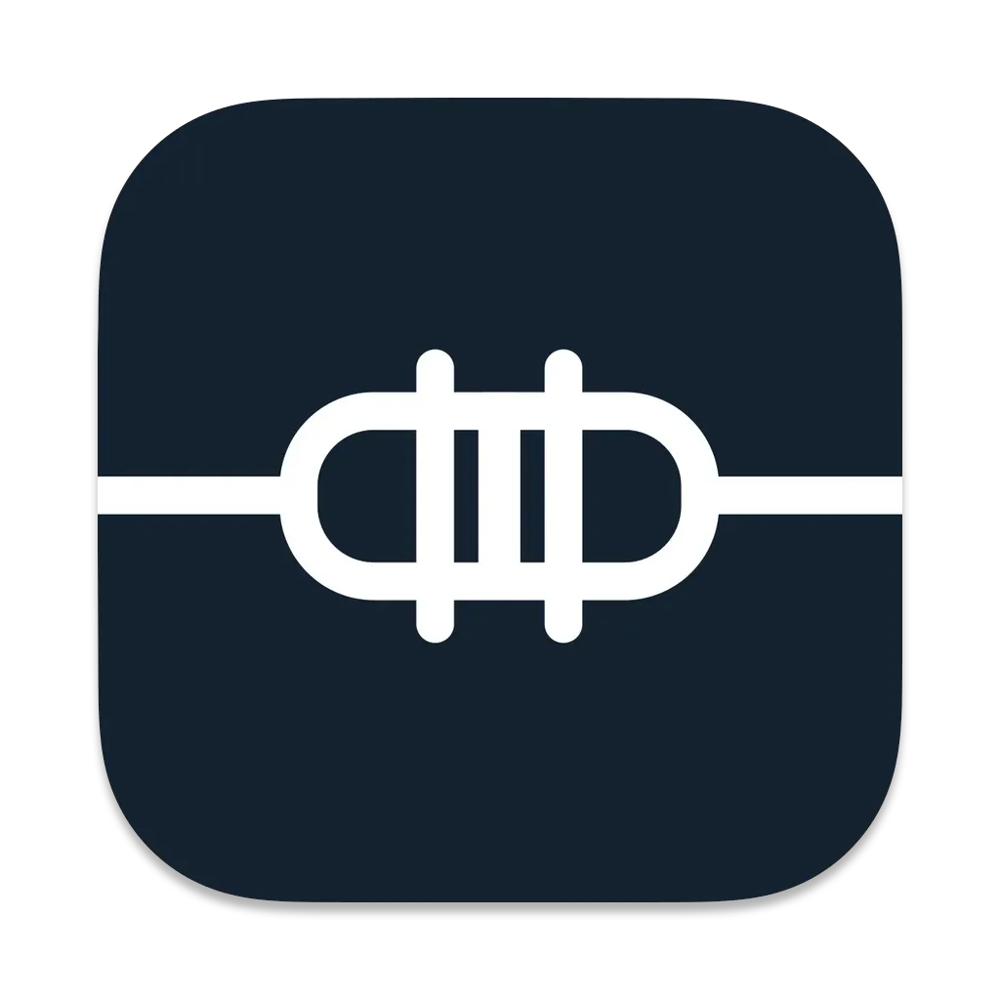

# Gyver Lamp



[![gyver_lamp][build_status_badge]][workflow_link]
![coverage][coverage_badge]
[![style: very good analysis][very_good_analysis_badge]][very_good_analysis_link]
[![License: MIT][license_badge]][license_link]

A companion application for [GyverLamp][gyver_lamp_repo_link] build with [Flutter][flutter_link].

Huge thanks to [Iryna][dribbble_link] for the design and support ❤️

---

## Application Highlights ✨

### Animated splash screen made with [Rive][rive_link]

https://github.com/ksokolovskyi/gyver_lamp/assets/30288967/c7e6f231-54b6-4ffa-aa87-e4f2fef2c3ef

Thanks to [JcToon][rive_animation_link] for publishing the animation.

### Straightforward connection process and automatic reconnect

https://github.com/ksokolovskyi/gyver_lamp/assets/30288967/8a57c180-f5f7-435f-bc50-ce9db84aa110

### Animated preview of all supported effects

https://github.com/ksokolovskyi/gyver_lamp/assets/30288967/0bb0bd96-11b6-4cb5-b211-96cc88636989

https://github.com/ksokolovskyi/gyver_lamp/assets/30288967/2e058762-97c1-47b8-907d-4537d9c2f405

### Intuitive controls with real-time preview

https://github.com/ksokolovskyi/gyver_lamp/assets/30288967/bdc059bf-830a-440e-9863-f98dad767f24

### Multi-language support

https://github.com/ksokolovskyi/gyver_lamp/assets/30288967/c9b1042d-d8dc-4ef2-9ac6-73cf19355381

### Dark mode support

https://github.com/ksokolovskyi/gyver_lamp/assets/30288967/0d9766bc-2abe-46f8-b609-8308bcf2d0cd

---

## Getting Started 🚀

This project contains 2 entry points:

- development
- production

To run the desired entry point either use the launch configuration in VSCode/Android Studio or use the following commands:

```sh
# Development
$ flutter run --target lib/main_development.dart

# Production
$ flutter run --target lib/main_production.dart
```

[workflow_link]: https://github.com/ksokolovskyi/gyver_lamp/actions/workflows/gyver_lamp.yaml
[build_status_badge]: https://github.com/ksokolovskyi/gyver_lamp/actions/workflows/gyver_lamp.yaml/badge.svg
[coverage_badge]: coverage_badge.svg
[very_good_analysis_badge]: https://img.shields.io/badge/style-very_good_analysis-B22C89.svg
[very_good_analysis_link]: https://pub.dev/packages/very_good_analysis
[license_badge]: https://img.shields.io/badge/license-MIT-blue.svg
[license_link]: https://opensource.org/licenses/MIT
[gyver_lamp_repo_link]: https://github.com/AlexGyver/GyverLamp
[flutter_link]: https://flutter.dev
[dribbble_link]: https://dribbble.com/ira_dehtiar
[rive_link]: https://rive.app/
[rive_animation_link]: https://rive.app/community/450-872-onoff-switch/
